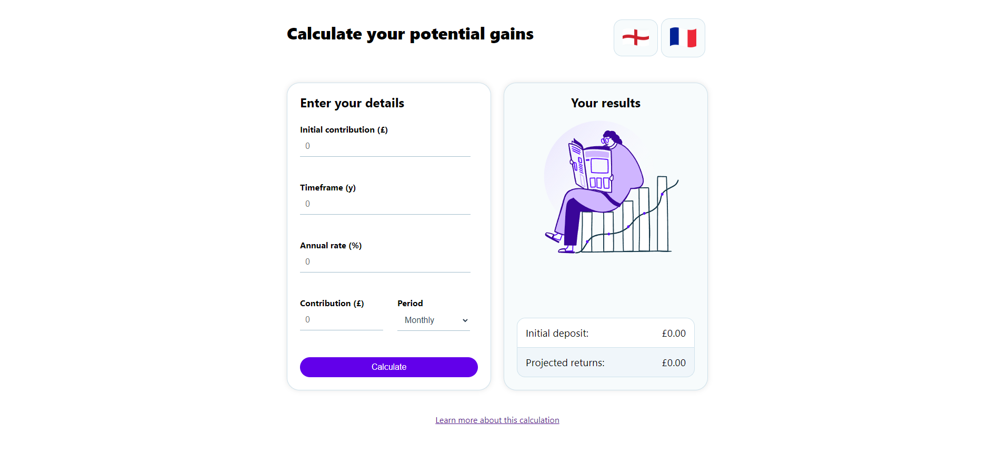

# Financial Calculator



## Overview

This project is a responsive web component for a financial calculator built using ReactJS. The component allows users to estimate their potential gains based on various inputs and displays the results dynamically.

## Features

- **Input Form**:
  - **Initial Contribution**: The amount of money initially invested.
  - **Investment Timeframe**: Duration of the investment in years (0-100 range).
  - **Annual Interest Rate**: Interest rate applied annually (0%-10% range).
  - **Periodic Contributions**: Regular contributions with a selector for contribution period (monthly, quarterly, annually).

- **Calculate Button**: Computes the future value of the investment and displays results.

- **Results Display**:
  - **Initial Deposit**: Displays the initial amount of money invested.
  - **Projected Returns**: Shows the future value of the investment.

- **Localization**: The component is localized in English (UK) and French.

- **Currency Formatting**:
  - **UK**: £0,000.00
  - **France**: 0 000,00 €

## Technologies Used

- **ReactJS**: For building the user interface and handling the component logic.
- **i18next**: For internationalization (i18n) to support multiple languages.
- **JavaScript**: The preferred scripting language for the component's functionality.

## How to Run the App

### Running Locally

To run the app locally, follow these steps:

1. **Clone the Repository**:

    ```bash
    git clone https://github.com/Mylothros/financial-calculator.git
    ```

2. **Install Dependencies**:

    Ensure you have [Node.js](https://nodejs.org/) installed. Then, run:

    ```bash
    npm install
    ```

3. **Start the Development Server**:

    ```bash
    npm start
    ```

    This will start the development server and open the app in your default web browser at `http://localhost:3000`.

### Running the App from AWS

The application is hosted on AWS and you can view it directly from the static website URL:

[http://financial-calculator.s3-website-us-east-1.amazonaws.com/](http://financial-calculator.s3-website-us-east-1.amazonaws.com/)

You don’t need to run the app locally to test it. Use the link above to access the deployed version of the app.

## Running Tests

To ensure the app works correctly and to validate that the component logic behaves as expected, follow these steps to run the tests:

### Run the Tests

Execute the following command to run the test suite:

```
npm test
```

This command will start Jest and run all the tests in the __tests__ directory and any files with .test.js.

### View Test Results

After running the tests, Jest will provide a summary of the test results in the terminal. This includes information about which tests passed and which tests failed.

## Formula for Calculation

The future value of the investment is calculated using the following formula:

\[ A = P \left(1 + \frac{r}{n}\right)^{nt} + \frac{PMT \left[\left(1 + \frac{r}{n}\right)^{nt} - 1\right]}{\frac{r}{n}} \]

Where:
- **P**: Principal (Initial Contribution)
- **t**: Number of years (Investment Timeframe)
- **PMT**: Regular periodic deposit (Contribution)
- **r**: Annual interest rate (Annual Rate)
- **n**: Number of compounding periods per year (1 for annually, 12 for monthly, 4 for quarterly)
- **A**: Future value of the investment (Projected Returns)
- **R**: Future investment value Return amount